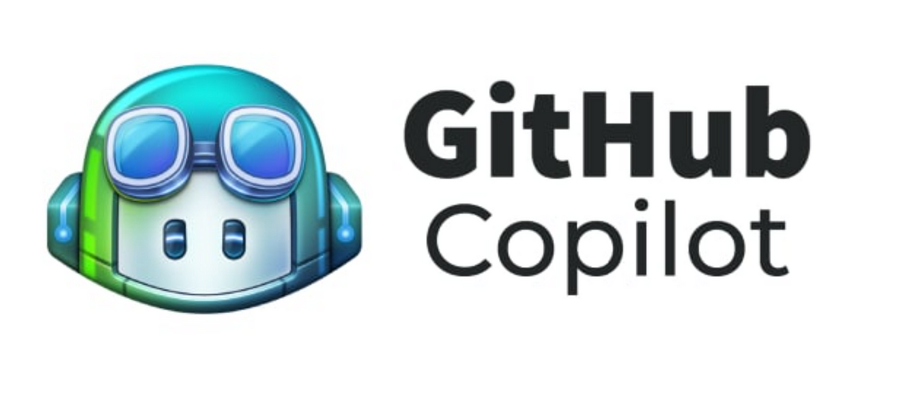

<div style ="text-align:center">
  
</div>

## AI'm with you

Artificial Intelligence (AI) has had a significant impact on the way we learn positively and negatively. While it has made learning more accessible and efficient, one of the problems I have encountered with AI is that we may be too co-dependent on it. When talking about its place in software engineering, it is scary how helpful it can be. For example, OpenAI's GPT-3 is a language model that can generate human-like text. It can be used to write essays, code, and even poetry. It is a powerful tool that can help us in our work, but it can also be a crutch that we rely on too much.

## Addressing the Usage of AI in these list of topics we learned in class

1. Experience WODs
- For experience WODs, I have not used any AI tools as experience WODs are beneficial to use without AI. The experience WODs are sufficiently provided with information to help you complete the WODs without the need for AI. Professor Johnson goes through each experience WODs thoroughly to help you understand the concept and the screencast provided helps assist you in completing the WODs.
2. In-class Practice WODs
- For In-class practice WODs, I have not used any AI tools as these usually happen in a group setting where we can help each other out. The In-class practice WODs were not as difficult as it gave an accurate representation of what the real WODs would look like every Thursday. If anything, the only time I would use AI for In-class practice WODs would be as a last resort if my group or partner could not figure out the problem to avoid wasting time.
3. In-class WODs
- I have used AI in helping me complete the underscore WOD as it was a concept I was not too familiar with. It was a whole new set of functions that I have never seen before, which is essentially trying to learn a new language that I personally felt was not going to use in the near future. With that reasoning, I have used Copilot to help me with the underscore WODs by telling me which functions to use and how to use them. The documentation of all the functions were not as appealing to me the way Copilot presented them. It was more straightforward and easy to understand.
- For example, I would ask copilot "Give me an example of using the _.filter function" and it would give me a code snippet that I could use to help me understand how to use the function. It would look like this 
```javascript
  var_ = require('underscore');
  var numbers = [1, 2, 3, 4, 5, 6]
  var evenNumbers = _.filter(numbers, function(num) {
  return num % 2 === 0;
  });
  console.log(evenNumbers); // [2, 4, 6]
  ```
- Then it would give me a description of what line does what which was very helpful in understanding the code.
4. Essays
- For Essays, when I had trouble forming sentences of paragraphs, I would use ChatGPT to help me with my grammar and spelling mistakes. I would ask ChatGPT questions like "Can you check this essay for any spelling/grammatical errors" or "Do these paragraphs flow well with each other?" and it would give me suggestions on how to fix the errors. It was very helpful in helping me write essays that at the same time felt professional and in my own voice.
- I go into essays with first blurting our any ideas I had in my head, going really fast without thinking too much on grammar and spelling; trying to just get the thoughts out on paper. Then I would have a second read and ask myself questions like "Does this make sense?", "Does this need a bit more/less", "Did I cook too much?", which AI can assist me in. It would give me ideas to expand on that I had not thought of initially.
- Additionally, it is fun asking ChatGPT for any analogies or metaphors that I could use in my essays to make them more fun and engaging. It is fun to look at the suggestions it gives me, but sometimes it can be a bit too much. For example, I admittedly used it for my design patterns essay and after reading it again, it felt like it was too good to be written by a regular human.
5. Final project
- For the final project, I have asked Copilot to help me create testcafe test cases for the pages on our web application. There were so many times when the testCafe would have errors where it says "Element not found" or "Element not visible" and I would have no idea how to fix it. I would ask Copilot to help me create testcafe test cases for the pages on our web application. There would also be ID mismatches where the ID would be different from the one I have in my code. I would ask Copilot then to help me find where these errors lie and how to fix them.
- An example of this would be "Using this testcafe example (testcafe code pasted from the assignment page), how do I create a testcafe test case for this page (page name)?" and it would give me a code snippets telling me to paste them in certain areas. The one thing they do not hold your hand in is telling you what files to create, you have to do it yourself.
6. Learning a concept / tutorial
- For learning a new concept / tutorial, I have not used AI in learning a concept or tutorial as most of the time I would ask my peers or the professor for help. Most of the modules are pretty straightforward and easy to understand. The information is sufficiently provided for you enough to understand the concept. The screencasts were very helpful and long enough that would help you get the concept by the end of it. Alyssia the TA was a big help as well if I could not reach anyone else.
7. Answering a question in class or in Discord
- For answering a question in class or in Discord, I have not used any AI tools in assisting my fellow peers. Any questions that I have answered were questions I have struggled with myself and have found the answer to. I have always been afraid of answering a question that felt like might be wrong but overtime I have learned that it is safe to always try as it is a learning experience and that discussions in finding the answers are always healthy and productive.
8. Asking or answering a smart-question
- For asking or answering a smart-question, I have not used any AI tools as I have hardly asked any smart questions or answered any questions. This is because I felt like I did not have enough knowledge to ask a smart question or answer a question that I was struggling with. If anything, the questions or answers that were asked have answers that were already provided and me asking it would have been too redundant.
9. Coding example
- For coding examples, I have used AI numerous of times to explain code that I did not understand. I would ask Copilot to help me explain the code and provide comments on what each line does. This goes for ICS classes outside 314 as well. Recently, I have found it really hard to pay attention to reading the books as the text can be overwhelming and long so asking AI to summarize it while providing code snippets saves time and effort. 
- A recent example of what coding examples I have asked for was for testCafe tests for the final project. I have asked Copilot to give me an introductory example of how to write a testCafe test for our group web application.
10. Explaining code
- For explaining code, I have used AI if the concept became too cryptic and overwhelming for me to understand. As mentioned before, if I felt like I was not really getting the gist of the code, I would ask AI to help me explain the code and provide comments in a way that I could understand. Asking ChatGPT to give inline comments is very helpful as you can see what each line does and how it affects the code.
- Examples questions that are beneficial rather than just giving it to you bluntly that I have asked would be "What does this line of code do?" or you could revamp it to "What does this code do and can you explain each line with inline comments" to help better summarize the code.
11. Writing Code
- I have used AI in writing code as it helps me how to write code in a more efficient way or if following any ESLint formatting errors. I try not to ask AI to help assist me in completely answering questions for me as it would be too harmful to my learning. If I am truly stuck, then I would ask but only after I have tried to solve the problem myself.
- Example questions would be the following - "I have an ESLint error here and I don't know how to fix it, how would it look like if I fixed it?" or "How do I write this code in a more efficient way?"
- In this way, rather than getting the answer explicitly, it kind of walks me through the answer which is more beneficial to my learning.
12. Documenting code
- I have not used AI in documenting code as most of the problems I have in regard to documenting code is familiar to me and have no problems solving myself.
13. Quality assurance
- I have used AI in quality assurance as it helps me with error checking and formatting issues. This was especially useful when using style.css as it would give me suggestions on how to fix small formatting and padding issues that I would not know how modify. For our final project, as the style.css started to get very long and overwhelming, some of the IDs attached to certain headers and templates would be too confusing to read and would often take too long to identify. Asking ChatGPT to assist me to find where these header settings were and to make sure they matched was surely helpful and saved me a lot of time. 
14. Other uses in ICS 314 not listed
- Other uses in ICS 314 not listed was using AI to help me on other ICS classes such as ICS 313 where we learn a lot about programming languages. Some of the programming languages there like Haskell and Lojban were very difficult to understand and without AI tools, these would have been very tough and time-consuming to learn as it had very different paradigms from what I am used to compared to this class. I have also used it for my ICS 434 class which is Data Science Fundamentals, and it assisted my greatly on how to use pandas and numpy in Python and how to create good-looking plots in matplotlib.  


## AI tools and me

Before class, I have been using ChatGPT as an assistance tool for any debugging issues or questions I have regarding any grammatical or spelling mistakes for other classes. Recently I have been introduced to Github Copilot which is a handy dandy extension that I use in IntelliJ and Visual Studio Code. It functions the same way as ChatGPT but it reads your code better since it's on the same application which does not require you to copy and paste your code. 

<div style="float:left; margin-right:20px;">
  
</div>

It is safe to admit that I have become dependent on these tools. However, I believe that AI will become more integrated into our lives and work in the future so getting familiar with it is a good idea for me. Rather than using it to tell me what to do, I have been using it in a way that positively impacts my learning which is having it assist me where things go wrong rather than telling me how to do things. It is always safe to do things yourself first before asking AI for help which is the smart way to go about it.

Even now when writing this essay, the image you see above was scaled down using AI to help me find the perfect fit.

## Am AI relevant in and outside of class?

My personal experiences with AI tools in class have been a hit or miss. I favor copilot more than ChatGPT as ChatGPT will sometimes lose track of the whole picture and rather focuses on one piece of information at a time. Copilot on the other hand remembers most of its knowledge and questions the user has asked previously which is a plus. I have used ChatGPT mainly for grammatical/spelling mistakes and Copilot for coding problems. In what I have used it in class, I have used it mostly for the underscore WODs as underscore was a concept I have not been too familiar with and do not see myself using in the future. I have also been using it for error checking, formatting issues when using style.css, and the final project.

It is scary how helpful AI can be in our work. As the years go by the model by then would probably be at a point where it would literally do everything for us, probably when GPT-5 starts to become available to the public. By then, I wonder how the use of AI will impact the generations to come. Will it be a good thing or a bad thing? Only time will tell.

As for its practicality outside of class, AI has been used for many types of media such as art and music. For example, people have been using AI to propagate false information, create deepfakes, and even create fake news. On TikTok, there are videos of people using AI to create covers of songs in their favorite artists voice. In software engineering outside of class, I am not aware of any AI tools that are used in the industry.

## Limitations and Challenges AI've faced

Within the course, challenges and limitations that I have faced were mainly during the JavaScript WODs where the code was not working as intended. I would ask Copilot how to specifically orient things to look like the Morning Brew example image, and it would give me a code snippet that would not exactly fit the specifications needed. They would get the picture but not the whole picture. I would have to make minor adjustments to the code to make it work as intended.

<div style="float:right; margin-left:20px;">
  
</div>

A suggestion I would have for further integration into the usage of AI in the course would be having an AI bot with the GPT-3 model in the main ICS 314 site where it can ask if you have any questions or concerns regarding the course. I think it would be a fun and engaging integration as it can get overwhelming sometimes trying to find everything you need to know about the course and the content. Another suggestion would be that my other ICS professors have done is how to ask the right questions to ChatGPT or Copilot, so it gives you the right answers while it being beneficial to your learning. This would be a great way to help students learn without looking at the answers directly.

## Comparative Analysis

The big difference between traditional learning and AI learning is that AI learning gives you the information you need when you need it. In traditional learning, any questions you have would have to be answered by the professor or your peers and sometimes these answers are not immediate, which AI learning can provide. Traditional learning is good for social interactions and building relationships with your peers and professors which AI cannot provide. The information you get from traditional learning is more reliable and trustworthy than AI learning as AI learning can sometimes give you false information. The most important part about traditional learning that AI cannot take away is that traditional learning helps you build social skills which is important in the workforce and in life.

## The future of AI in Software Engineering

The future of AI in software engineering is bright. As the years go by, AI will become a lot smarter that it will become unavoidable to use for students. It will become too reliant to the point where educators will have to tie it into their coursework to help students learn and ask questions on it more efficiently. It is hurtful to not mention the usage of AI's to other students as it will be the future of learning. As we get smarter, so will AI. It will be a tool that will help us in our work and in our lives. It will be a tool that will help us learn and grow. It will be a tool that will help us become better people and will be a tool that will help us become better software engineers depending on how we use it.

## Conclusion

In conclusion, the integration of AI into our learning experiences, particularly in software engineering, presents both opportunities and challenges for our current and future generations. While AI tools like ChatGPT and GitHub Copilot offer immense assistance in coding, debugging, and even writing essays, there's a fine line between using them as aids and become overly dependent. As AI continues to advance, it will undoubtedly play a significant role in education and the industry. However, it's always important to maintain a balance between leveraging AI's capabilities and nurturing traditional learning methods that create social interaction and critical thinking. Ultimately, how we navigate this intersection between human intellect and artificial intelligence will shape the future of software engineering and beyond.


