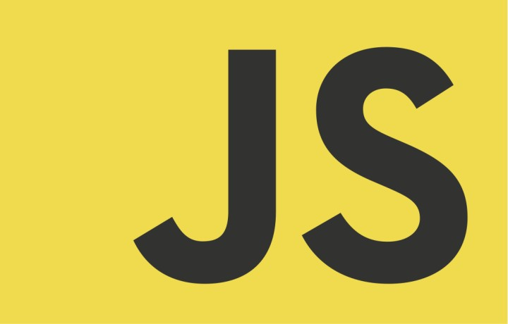

<div style ="text-align:center">
  
</div>

Javascript as a complete newbie was a very challenging experience. However, as I started knocking out questions from the freecodecamp site the professor has provided us, I noticed similarities with the syntax of other languages. At initial thought, I surmised that Javascript and Java would be pretty similar seeing that they derive from each other's names. To my surprise, they actually do as JavaScript and Java use syntax which I assume JavaScript has grabbed inspiration from. One example of syntax similarity between JavaScript and Java is the use of curly braces '{ }' to define blocks of code. Here's a sample :

```javascript
function greet(name) { // Done in JavaScript
    console.log("Hello, " + name + "!");
}

if (true) {
    greet("Carlo");
}
```

```java
public class Greeting { // Done in Java
    public static void main(String[] args) {
        greet("Carlo");
    }

    static void greet(String name) {
        System.out.println("Hello, " + name + "!");
    }
}
```

In both cases, you can see the use of curly braces to define the scope of the function 'greet' and the block of code inside the 'if' statement which is one of many syntactic similarities between JavaScript and Java. This also holds true for C and C++ as well, languages that I have used previously in other classes.

As I got further into the freecodecamp course on JavaScript, it became increasingly difficult. A major weakness that I have is the use of for loops, while loops, and do while loops, which they had a lot of. Of course with a new language, the struggle was also using loops in a new environment. With the overall knowledge that I've gained from the 113 questions from the introduction to JavaScript, it was a good transition into the challenging part that is ES6. It became a lot more technical and required you to think a lot harder which was very stress-inducing but rewarding once you got the question down.

Going through that introduction and ES6, I can say from my perspective, JavaScript is a good programming language from a software engineering perspective. As someone who aspires to work in front-end web development, JavaScript is the language I need to master as it is supported by many web browsers like Google Chrome, Mozilla Firefox, Safari, and Microsoft Edge which are very popular today. With all those questions we had to do, I still feel that there is more that I can learn from JavaScript as it is still early in the semester, which i'm very excited about. Languages such as HTML and CSS compliment JavaScript very well that I hope we get to integrate throughout the course.

As for athletic software engineering, I thought the concept was daunting at first, but I feel that as the semester goes on, it will help me achieve the skills that I need outside the course and prepare me for coding interviews. Going into the class I knew practice WODs existed, and hearing about it from my friends, it gave me a lot of stress. However, this stress is what fuels me into studying so that I become more prepared for the many WODs that are to come. The professor mentioned how everyone struggles at first with WODs which made me feel a little bit relieved seeing that I am not the only one worried about it. I can see why it is beneficiary because not only does it help you solve challenging problems, but how to solve them in time for when we have coding interviews in the real world. 


