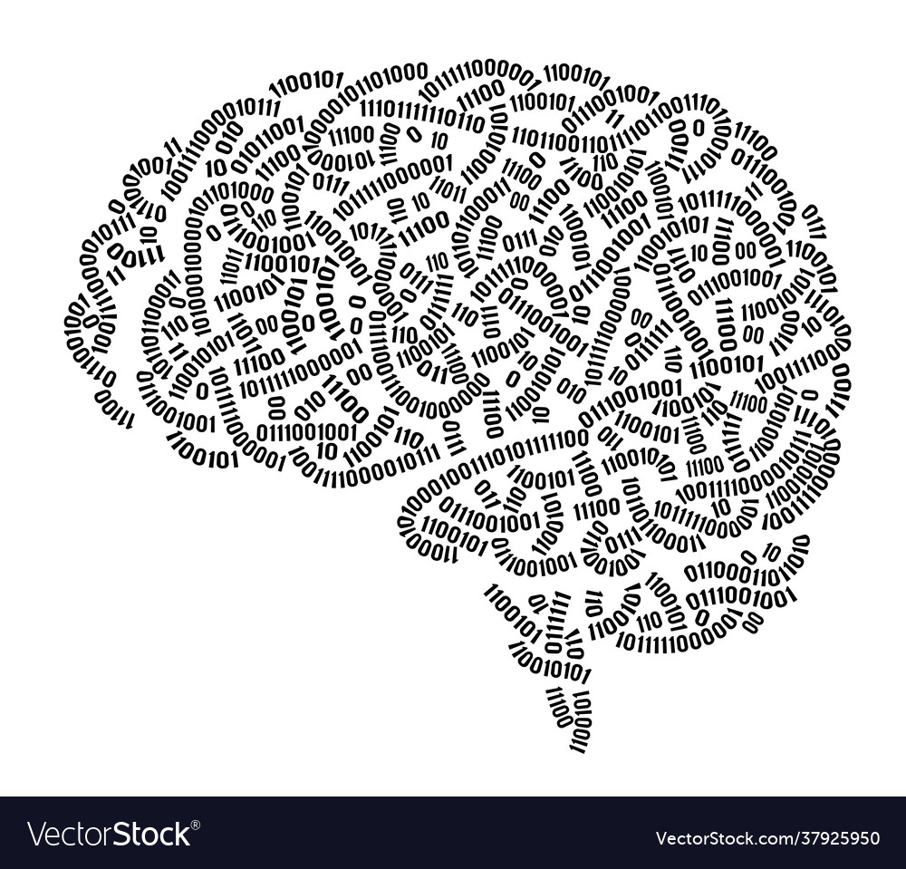

# My Life in Code

  

  My passion for software development ignited as I began viewing the world through the lens of challenges that could be addressed with code. Growing up as an avid video gamer,
  there were many things that I could critique about a video game that could easily be addressed with more efficient coding, the only problem was how. Game mechanics such as movement,
  AI behavior, NPC interactions, terrain modeling, fighting, and many more started to be put under a coding microscope for me, something that I have not previously done. Before I would
  just look at it for what it was as a player but not really on the developer side of things. That's when it started to become more interesting for me and sparked my interest not only
  in game development, but the entirety of software development.

  Take a plain basic shield for example, its purpose is to just block attacks, but it can be so much more. It is not as flashy as a sword you could brandish around, but from the mind
  of a game developer, the possibilities are endless. You could add spikes to it, have the character utilize it as a projectile like Captain America's shield, or it could morph into
  a rideable mount to help you navigate through the world. That's one of my inspirations into becoming a game developer, it's being able to make your ideas into a reality which code
  can help you achieve that. As I journey through my college career, I hope to unlock the data structures / algorithms that were unknown to me to then be revealed and help me figure
  out why game developers use x or y into building their fantasy world.

  In the future, the skills and experiences I hope to develop in the future is to learn about the process of developing these games, and the languages that are most commonly used as well.
  There are a myriad of skills that I want to develop and as each semester goes by, my goal is to master those skills to become a well rounded developer. My biggest inspiration that I like
  to draw on from time to time is RIOT games who developed League of Legends, Valorant, and Teamfight tactics, all games that I love playing. I've been challenging myself to think of what
  algorithms they use to develop the mechanics in their games in hopes that I would be able to do that myself. Before I graduate, I hope that I have the languages and skillsets needed to
  live my dreams.

  
