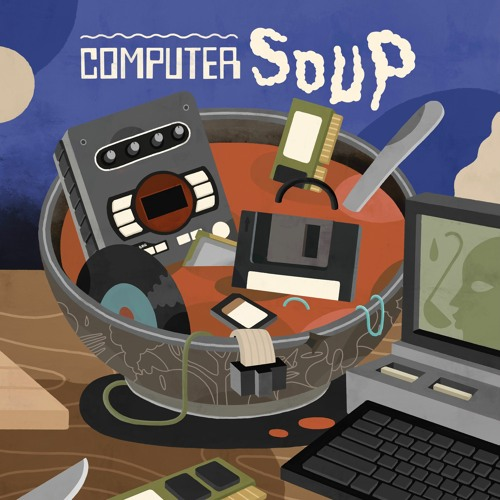
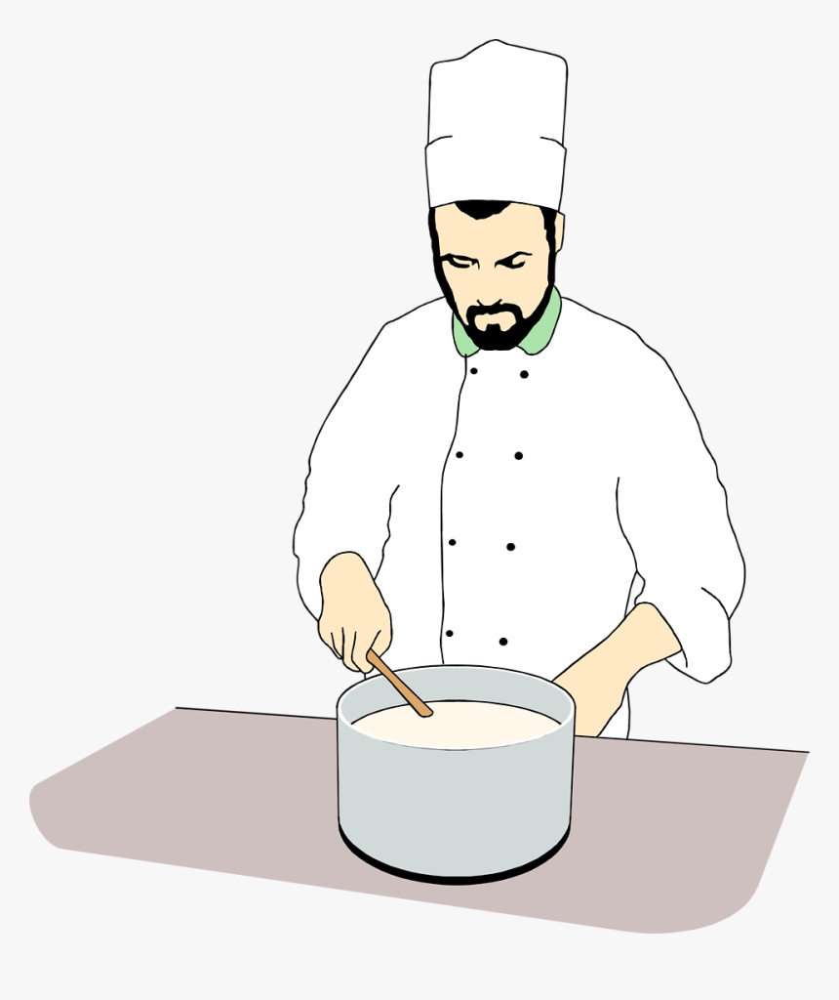

  

## The Right Approach in Cooking and Coding

When it comes to cooking up solutions, whether in the kitchen or behind a screen, the recipe matters. Just like a chef relies on a recipe to whip up a dish, as a programmer, I lean on design patterns to tackle coding challenges. Think of recipes as blueprints guiding us through the culinary journey, and design patterns as the roadmap leading us to elegant solutions in programming.

    

## Sticking to the Recipe

Much like a chef follows a recipe meticulously, I stick to design patterns to craft clean, efficient code. Just as a recipe lists out ingredients and steps, a design patterns outlines or lays out a tried-and-true method for solving recurring problems in software design. It's the playbook that shapes the structure of our code and guides our development process.

## Some Recipes are more complex than others

Just as a chef selects the perfect recipe for a dish, I carefully choose the appropriate design pattern for each coding problem. Opting for a complex pattern when a simple one will suffice is similar to using a Beef Wellington recipe for a quick breakfast- unnecessarily complicated and likely to leave you hungry for simpler solutions.

    

With both cooking and coding, the key lies in choosing the right recipe which is the one that balances complexity with practicality, and ultimately delivers a satisfying result. Just as a chef needs to know when to use a recipe for a soufflé versus a recipe for a sandwich, a programmer needs to know when to use a design pattern for a singleton versus a design pattern for a factory.

## Conclusion

In conclusion, just as a chef needs to choose the right recipe for the dish they're preparing, a programmer needs to choose the right design pattern for the problem they're solving. Using the right recipe will result in a successful dish, just as using the right design pattern will result in successful code. So, the next time you're faced with a programming problem, make sure to choose the right recipe for the job.

