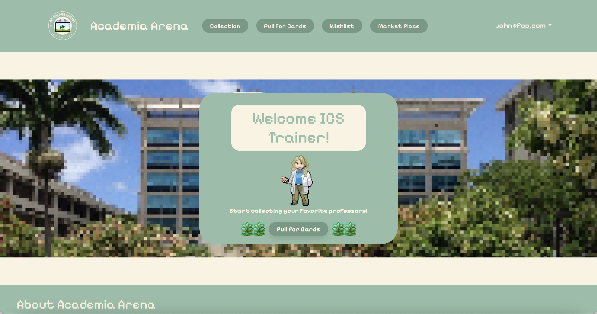
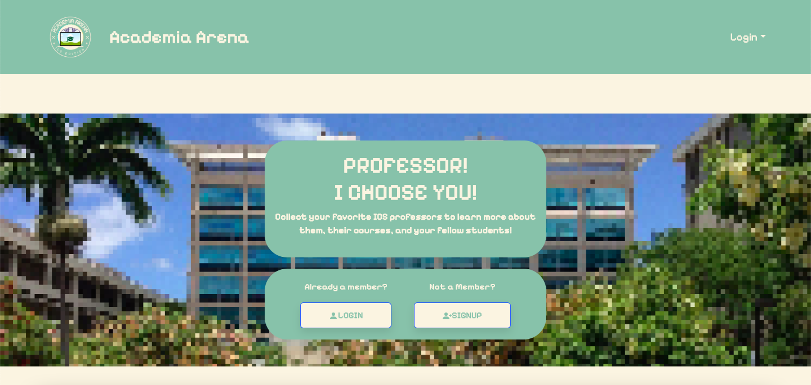

  

  

  <a href="https://academia-arena.github.io/">Our GitHub Homepage</a>

  <a href="https://academia-arena.xyz/">Our Academia Arena Site</a>

This web application is the final project that me and my group members worked on that is a testament to all the things we have learned in ICS314. The purpose of this website is to hopefully bridge the gap between students and professors to help students feel more engaged with their professors as well as find a way to connect with not only them but other students as well. We designed this site in a way that students are able to collect and trade cards with other students to help them interact and socialize so that they would be able to find friends in the ICS department. These cards contain information about the professors name, the rarity of the card, the power level, classes they teach, and a fun fact about them that students can collect and trade if they have any duplicates and want unique cards that they do not have.

Other features on the site include a marketplace where students can list the card that they want to trade, and a list of cards that are up for sale from other students. There is a wishlist that shows all the cards that are available to collect but from a regular users viewpoint, these cards only display the professors name and pictures with all the information hidden. On the admin side, these are readily available to view as we wanted students to have motivation to collect their professors cards to see what kinds of facts and information they have to know their professor better. Admins can also edit, add, and delete cards from the database if any updates to the list of ICS professors changes or if we want to expand on professors outside of the ICS department.

Overall, this project taught me a lot of how far I have come with my HTML and CSS skills. It also taught me how to work in a group setting and how to appoint GitHub issues to our members so that the workload is efficiently divided where no one would feel to stressed. In the future when we have careers, this project serves as an introduction on how to work with other people that will prove useful for when we do have a career. When I master HTML and CSS as well as React which has become very popular these days, I am excited to see where this takes me as I had a very fun time creating this site with my fellow groupmates.
