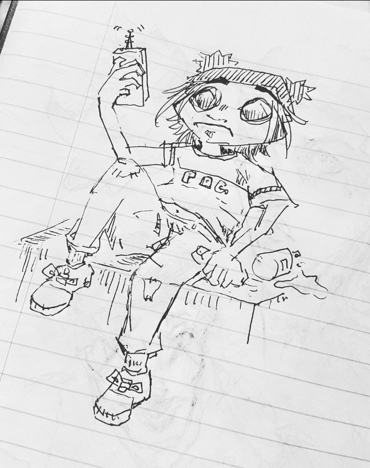

  

  <a href="https://www.instagram.com/cvilart_/">Carlo Viloria (cvilart_) on Instagram</a>

This instagram project serves as a dedicated platform highlighting a collection of my artistic creations spanning several years. The primary objective of this page is to not only share my creations, but to hopefully establish connections with fellow creators, including graphic designers, concept artists, and individuals within the fine arts community, creating collaborative opportunities and engaging those intrigued by my artistic vision. The majority of my creations draw inspiration from the realm of video games, where I offer my unique interpretation of characters through diverse media forms. This project taught me how to expand my creative/artistic skills and how to market my creations through social media. This project also taught me how to use Photoshop for editing purposes if needed which is a really important skill for me to learn if I want to get into web development and creating assets. 

While this page is under development, I aspire to extend its scope to encompass graphic design, producing assets that can be utilized by other designers for various purposes, such as website development, game development, etc,.
